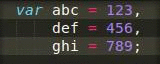

# sublime-js-var-shortcuts [](https://travis-ci.org/twolfson/sublime-js-var-shortcuts)

Insert and delete shortcuts for JavaScript variables in [Sublime Text][]

This was built for (1) quickly setting up and tearing down variables, (2) proof of concept for [Sublime Text plugin testing framework][sublime-plugin-tests].

Currently, only tear down is supported.

[sublime-plugin-tests]: https://github.com/twolfson/sublime-plugin-tests/



## Getting Started
### Requirements
You must have [node][] installed on your machine. We use [esprima][] to locate the `var` statements.

[node]: http://nodejs.org/
[esprima]: http://esprima.org/

### Installation
This package is available under `JS Var Shortcuts` inside of [Package Control][pkg-control], a [Sublime Text][] plugin that allows for easy management of other plugins.

[Sublime Text]: http://sublimetext.com/
[pkg-control]: http://wbond.net/sublime_packages/package_control

If you prefer the manual route, you can install the script via the following command in the Sublime Text terminal (``ctrl+` ``) which utilizes `git clone`.

```python
import os; path=sublime.packages_path(); (os.makedirs(path) if not os.path.exists(path) else None); window.run_command('exec', {'cmd': ['git', 'clone', 'https://github.com/twolfson/sublime-js-var-shortcuts', 'JS Var Shortcuts'], 'working_dir': path})
```

Packages can be uninstalled via "Package Control: Remove Package" via the command pallete, `ctrl+shift+p` on Windows/Linux, `command+shift+p` on Mac.

### Usage
By default, we bind variable deletion to `ctrl+backspace` on Windows/Linux, `command+backspace` on Mac. If no variables are selected, the default action (delete word on left) will be taken.

If you would like to add your own key binding, the deletion command is available as `js_var_delete`.

```json
{
  "keys": ["ctrl+delete"],
  "command": "js_var_delete"
}
```

## Contributing
In lieu of a formal styleguide, take care to maintain the existing coding style. Test via `nosetests`.

## Donating
Support this project and [others by twolfson][gittip] via [gittip][].

[![Support via Gittip][gittip-badge]][gittip]

[gittip-badge]: https://rawgithub.com/twolfson/gittip-badge/master/dist/gittip.png
[gittip]: https://www.gittip.com/twolfson/

## License
Copyright (c) 2013 Todd Wolfson

Licensed under the MIT license.
